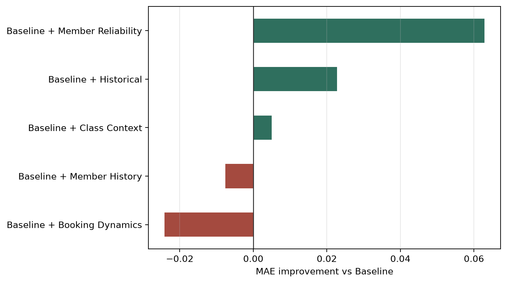
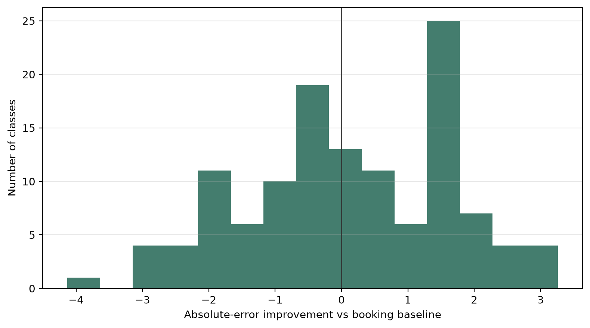

# Predicting Yoga Class Attendance

## Abstract

This project investigates whether final yoga-class attendance can be predicted more accurately **24 hours before class start** than by simply using the current number of bookings. Using historical attendance records and event-driven booking snapshots from a real yoga studio, I construct a leakage-aware prediction dataset and compare several regression approaches with chronological train, validation, and test periods. A compact Random Forest combining current booking-state information with member-level reliability features achieves a final test **MAE of 1.546 attendees** and **RMSE of 1.828**, compared with **1.680** and **2.213** for the current-booking-count benchmark. The main finding is that current booking state already contains most of the predictive signal, while historical member reliability adds a smaller but useful contribution and helps reduce some of the largest booking-count errors.

## Research Question

Bookings continue to change before a class starts, and being booked does not guarantee attendance. Late cancellations, waiting lists, recurring bookings, and differences in individual show-up behavior create uncertainty.

The central question is:

> **Can final class attendance be predicted more accurately 24 hours before class start than by using the current booking count alone?**

The project also asks which additional information is genuinely useful and whether a more complex feature representation improves generalization.

## Data and Prediction Task

The analysis combines two datasets from the studio booking system:

- **7,830 booking snapshots**, recording booking-state changes before classes
- **5,340 attendance records**, providing final class attendance and historical context

Detailed booking-event data cover approximately one year, while final attendance history extends substantially further back. The two sources yield **804 matched classes** with both booking activity and a final attendance label.

For each class, the prediction time is defined as **24 hours before class start**. The modeling dataset uses the **latest booking snapshot observed at or before that time**. Later events are excluded. If no snapshot has yet been observed, the class is excluded rather than incorrectly treated as having zero bookings.

This produces **762 prediction instances**.

The original data contain personal information and are therefore not included in the repository. The public synthetic dataset is generated from a statistical model calibrated to aggregate properties of the private studio data. It contains entirely synthetic members, classes, and booking histories while preserving key distributions and predictive relationships needed to reproduce the qualitative behavior of the analysis. It is not a pseudonymized copy of the original records. Because the synthetic data are newly generated rather than transformed original records, model metrics and other numerical results obtained from the synthetic dataset differ from those obtained on the original data. Numerical results reported here refer to the original studio data.

## Methodology

The analysis is organized around three principles:

**Temporal validity.** Historical features use only information available at prediction time, and model evaluation follows chronological rather than random splits.

**Strong baselines.** The main benchmark is the current number of booked attendees at the 24-hour prediction horizon.

**Parsimony.** More complex models and feature sets are retained only when they provide convincing out-of-sample improvement.

The chronological split contains:

| Split | Prediction instances | Period |
|---|---:|---|
| Train | 466 | May 2025 – Jan 2026 |
| Validation | 171 | Feb – Apr 2026 |
| Test | 125 | May – Jul 2026 |

Feature engineering covers current booking state, historical class attendance, member attendance history, member reliability, booking dynamics, and class context. The full representation contains **83 features**.

Several model families are compared, including Linear Regression, Ridge Regression, Random Forest, and Gradient Boosting. Random Forest performs best on the validation period.

Feature-group experiments show that adding **Member Reliability** to the strong 14-feature booking-state Baseline gives the best compact model:

- Baseline: validation MAE **1.499**
- Baseline + Member Reliability: **1.436**
- Full 83-feature representation: **1.471**

The selected model therefore uses only **26 features** rather than the full 83.



Random Forest hyperparameters are also investigated with expanding-window temporal cross-validation inside the training period. The CV-selected alternative does not improve outer-validation performance, so the simpler original configuration is retained.

## Final Test Performance

After the feature set, model family, and hyperparameters are fixed, the final model is refitted on train + validation and evaluated on the later test period.

| Model | Test MAE | Test RMSE | Mean error |
|---|---:|---:|---:|
| Current booking count | 1.680 | 2.213 | -0.032 |
| **Compact Random Forest** | **1.546** | **1.828** | **-0.095** |

The MAE improvement is modest: 24 hours before class start, the booking count is already a strong predictor. The larger improvement in RMSE shows that the model is more effective at avoiding some of the larger prediction errors.

Permutation importance supports the same overall interpretation: **current booking-state information dominates**, while Member Reliability contributes additional signal. The strongest reliability predictor is the long-term show-up rate of the members currently booked.

## Error Analysis

The final model has lower absolute error than the booking-count heuristic for **69 of 125 test classes (55.2%)**. Its advantage is therefore not that it improves every prediction.

Instead, much of the benefit comes from a smaller number of classes where the simple booking-count heuristic is substantially wrong. For classes at or above the 90th percentile of booking-count absolute error, the Random Forest reduces absolute error by **2.194 attendees on average**.



Prediction difficulty also varies with final class size. Classes with **5–7 attendees** are predicted most accurately, while low-attendance classes tend to be overpredicted and high-attendance classes tend to be underpredicted. This suggests some tendency toward middle-sized predictions.

## Main Findings

1. **Current booking state contains most of the predictive information.** The booking count itself is already a strong 24-hour benchmark.
2. **Machine learning adds a modest but useful improvement.** Test MAE falls from 1.680 to 1.546, while RMSE falls more clearly from 2.213 to 1.828.
3. **Member Reliability adds useful information beyond booking state.** It provides the strongest additional feature-group contribution.
4. **More features are not necessarily better.** The compact 26-feature model outperforms the full 83-feature representation on validation.
5. **The model is most useful on some of the difficult cases.** Its largest advantage over the simple heuristic comes from reducing several large booking-count errors.

## Repository Structure

```text
.
├── notebooks/
│   ├── 01_data_understanding.ipynb
│   ├── 02_constructing_the_modeling_dataset.ipynb
│   ├── 03_feature_engineering.ipynb
│   ├── 04_modeling.ipynb
│   └── 05_error_analysis.ipynb
├── src/
├── data/
│   └── synthetic/
├── figures/
└── tests/
```

### Notebooks

- **01 — Data Understanding:** source structure, quality checks, matching, and booking patterns
- **02 — Constructing the Modeling Dataset:** leakage-aware prediction instances at the 24-hour horizon
- **03 — Feature Engineering:** historical, member-level, reliability, booking-dynamics, and context features
- **04 — Modeling:** chronological evaluation, model and feature-group comparison, tuning, interpretation, and final test evaluation
- **05 — Error Analysis:** where the frozen final model succeeds and fails relative to the booking-count benchmark

## Reproducing the Workflow

The repository includes synthetic data so that the public workflow can be run without access to the private studio data.

```bash
uv sync
uv run jupyter lab
```

Run the notebooks in numerical order. Where available, set:

```python
USE_SYNTHETIC = True
```

The synthetic data reproduce the raw schemas, broad distributions, temporal coverage, booking dynamics, and member-reliability mechanism needed by the pipeline. Synthetic runs are intended to tell a similar qualitative modeling story, but they are not expected to reproduce the exact private-data results above.

## Limitations and Future Work

The detailed booking-event history covers only about one year, and the final test period contains 125 classes. The analysis also focuses on a single studio business and a single **24-hour prediction horizon**, so the results should not be assumed to transfer unchanged to other settings.

A particularly interesting extension is to compare **24-, 48-, and 72-hour prediction horizons**. Earlier predictions contain less current booking information, so this would test whether the relative value of historical and Member Reliability features increases as prediction lead time grows. Because the current test period has already been examined, such an analysis would be treated as a post-hoc extension or, ideally, confirmed on a new future holdout period.
